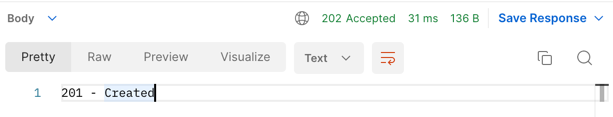
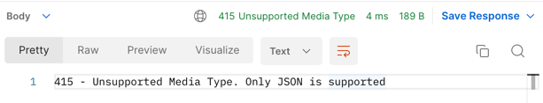

## Working with Middleware and RPC

- This is a learning project based on chapter 3 of Naren Yellavula's
  book [Building RESTful Web Services with Go](https://www.packtpub.com/product/building-restful-web-services-with-go/9781788294287)

### What is middleware?

- A middleware is an entity that hooks into a server's request/response processing.
- A middleware can have many components with each component having a specific function to perform.
- A middleware performs the following functions in order:
    - Processes an incoming request before hitting a specific handler
    - Processes the handler function
    - Processes the response before giving it to a client
- In applications with middleware, not all requests get to the API server. Wrong requests can be filtered and prevented
  from interacting with the **business logic**. Below are some of the most common cases:
    - Using a logger to log each request before hitting the REST API
    - Validating a user's session and keeping the communication alive
    - Authenticating a user
    - Writing custom logic to scrap the request data
    - Attaching properties to responses before serving the client
- A middleware, therefore, helps in keeping housekeeping work, like logging and authentication, in its right place.
- Go web frameworks like [Martini](https://github.com/go-martini/martini) and [Gin](https://github.com/gin-gonic/gin)
  provide middleware by default

#### Closures

- A **closure** is a function that returns another function. This is shown below:

```go
  package main

import "fmt"

func main() {
	numGenerator := generator()
	for i := 0; i < 5; i++ {
		fmt.Print(numGenerator(), "\t")
	}
}

func generator() func() int {
	var i = 0
	return func() int {
		i++
		return i
	}
}
```

- The output of the above program would be `1       2       3       4       5   `
- The principle of closure can also be used to implement a **counter** function and a function that satisfies
  the `http.Handler` interface

### Multiple middleware and chaining

- Using a package [Alice](https://github.com/justinas/alice) middleware handlers can be chained in a simple fashion as
  shown below:

```go
package main

import (
	"github.com/justinas/alice"
)

func main() {
	chain := alice.New(firstMiddlewareHandler, secondMiddlewareHandler,
		nMiddlewareHandler).Then(mainLogicHandler)
	http.Handle("/some-route", chain)

}
```

### RPC (Remote Procedure Call)

- A Remote Procedure Call (RPC) is an interprocess communication that exchanges information between various distributed
  systems.
- **Without implementing the functionality locally**, we can request things from a
  network that lies in another place or geographical region.
- The entire process can be broken down into the following steps:
    - Clients prepare function name and arguments to call
    - Clients send them to an RPC server by dialing a connection
    - The RPC server receives the function name and arguments
    - The server executes the remote process
    - The server sends back the message to the client
    - The client collects the data from the response and uses it appropriately

## Demos

#### 1. Creating a city

_**Sample request**_

```curl
curl --location --request POST 'localhost:8080/city' \
--header 'Content-Type: application/json' \
--data-raw '{
    "name": "Nairobi",
    "area": 696100000
}'
```

_**Response & Logs**_


```
Executing middleware before forwarding request to REST API
Got Nairobi City with area of 696100000 sq miles!
Executing middleware before sending REST API response to client
```

#### 2. Sending a request with unsupported MIME

_**Sample request**_

```curl
curl --location --request POST 'localhost:8080/city' \
--header 'Content-Type: text/plain' \
--data-raw '{
    "name": "Nairobi",
    "area": 696100000
}'
```

_**Response & Logs**_



```
2022/12/11 19:01:22 Entered filterContentType middleware
2022/12/11 19:01:22 Currently in the setServerTimeCookie middleware
2022/12/11 19:01:30 Entered filterContentType middleware
2022/12/11 19:01:30 Currently in the setServerTimeCookie middleware
2022/12/11 19:02:04 Entered filterContentType middleware
```
